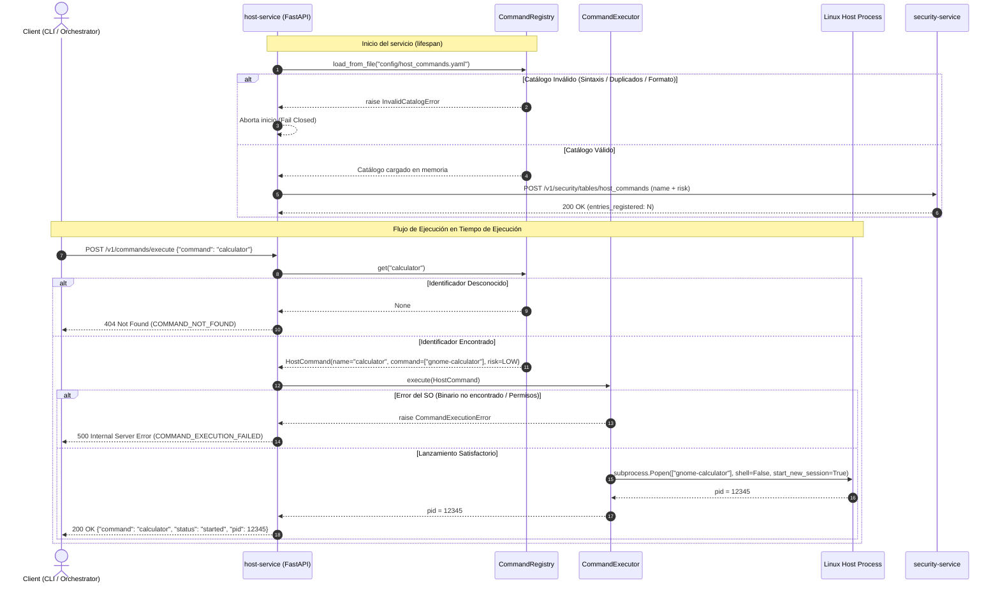

# Refinamiento de Feature: Host Service — Ejecución de Comandos del Host

- **Documento de Origen**: [host-service-command-execution-requirements.md](file:///home/danuser2018/workspace/home-assistant/docs/features/host-service-command-execution-requirements.md)
- **Fecha**: 2026-09-11
- **Estado**: Refinado / Listo para Desarrollo

---

## 1. Resumen y Contexto de Negocio

### Objetivo Principal
Ampliar las capacidades del microservicio nativo `host-service` (Capa de Abstracción de Host / Host Abstraction Layer - HAL) para proporcionar un mecanismo genérico, seguro y desacoplado de ejecución de comandos y aplicaciones del sistema operativo host mediante un **identificador lógico canónico** (`name`).

Actualmente, `host-service` expone únicamente APIs de control de volumen físico mediante `pactl` (`/v1/audio/*`) y publica una lista estática de riesgos desde `config/host_commands_risk.yaml` hacia `security-service`. Esta feature introduce la ejecución controlada de aplicaciones locales requeridas por Nova (tales como calculadora, navegador, backups o scripts locales de mantenimiento) asegurando los siguientes invariantes:
1. **Identificador como contrato único:** Los clientes del ecosistema (como el `orchestrator` o la CLI `novactl`) solo conocen y solicitan identificadores lógicos (p. ej., `"calculator"`). En ningún caso se reciben binarios directos, rutas de ejecutables ni argumentos arbitrarios del cliente.
2. **Fuente única de verdad:** Se unifica la configuración en `config/host_commands.yaml`, que sustituye por completo a `host_commands_risk.yaml`. Este catálogo define el identificador lógico, el vector de argumentos físico (`command` / `argv`) y el nivel de riesgo (`risk`).
3. **Seguridad por catálogo cerrado y sin shell:** La ejecución se realiza exclusivamente sobre comandos declarados previamente en el catálogo y mediante llamadas seguras `subprocess.Popen(argv, shell=False, start_new_session=True)`, eliminando riesgos de inyección de comandos o dependencias de shells del sistema.
4. **Separación estricta de responsabilidades:** `host-service` no aplica políticas de usuario ni decide si un usuario tiene permisos para invocar un comando; dicha autorización recae en `security-service`. `host-service` se encarga de ejecutar comandos registrados y publicar el catálogo de riesgos (`name` + `risk`) a `security-service` sin exponer el binario ni sus argumentos físicos.
5. **Ejecución no bloqueante en sesión de usuario:** Al ejecutarse `host-service` como un servicio de usuario de systemd (`systemd --user`), los procesos lanzados heredan el entorno gráfico y de sesión (`DISPLAY`, `WAYLAND_DISPLAY`, `DBUS_SESSION_BUS_ADDRESS`), devolviendo inmediatamente una respuesta con el estado de inicio y el PID sin bloquear al llamante.

### Actores e Interacciones
- **Cliente HTTP / Orquestador / CLI (`novactl`)**: Envía una petición `POST /v1/commands/execute` con el identificador lógico del comando (`{"command": "calculator"}`).
- **Host Service (`host-service`)**:
  - `CommandRegistry`: Carga y valida de forma estricta el fichero `config/host_commands.yaml` durante el arranque. Recupera la definición del comando a partir de su identificador lógico.
  - `CommandExecutor`: Lanza el subproceso de forma asíncrona mediante `subprocess.Popen` sin shell y desacoplado del grupo de procesos de `host-service`.
  - Adaptador HTTP (`src/routes/commands.py`): Expone el endpoint REST bajo los estándares de API de Nova-2 (ADR-004).
- **Security Service (`security-service`)**: Recibe en el arranque de `host-service` la publicación del catálogo de comandos y riesgos (`name` + `risk`) mediante `POST /v1/security/tables/host_commands` para alimentar su tabla de resolución dinámica de riesgos.
- **Sistema Operativo Host (Linux)**: Entorno donde se ejecuta el binario configurado dentro de la sesión de usuario activa.

---

## 2. Análisis de Servicios e Impacto

| Servicio | Nivel de Impacto | Componentes / Archivos Afectados | Tipo de Cambio | Descripción del Cambio |
| :--- | :--- | :--- | :--- | :--- |
| `host-service` | **Alto** | `requirements.txt`<br>`config/host_commands.yaml`<br>`config/host_commands_risk.yaml` (eliminar)<br>`src/config.py`<br>`src/models/commands.py`<br>`src/models/error.py`<br>`src/services/command_registry.py`<br>`src/services/command_executor.py`<br>`src/services/command_catalog.py` (deprecar/migrar)<br>`src/routes/commands.py`<br>`src/app.py`<br>`tests/` | **Modificar / Añadir** | Añadir dependencia `pyyaml`. Crear `host_commands.yaml` y eliminar `host_commands_risk.yaml`. Implementar `CommandRegistry` (carga fail-closed, validación y exportación de seguridad), `CommandExecutor` (lanzador asíncrono con `subprocess.Popen`, sin shell, `start_new_session=True`), modelos Pydantic, router REST `/v1/commands/execute` y manejadores de error bajo ADR-004. Integrar validación en el `lifespan` de FastAPI. |
| `security-service` | **Ninguno (Compatible)** | N/A | **Ninguno** | Ya expone el endpoint `POST /v1/security/tables/{table_name}`. El payload enviado por `host-service` mantiene el formato contractual exacto `{"commands": [{"name": str, "risk": str}]}`, asegurando total retrocompatibilidad. |
| `home-assistant` | **Medio** | `docs/services.md`<br>`docs/architecture.md`<br>`docs/refinement/host_service_command_execution_refinement.md`<br>`docs/adr/adr-026-host-service-command-execution.md` | **Modificar / Añadir** | Actualizar la ficha de `host-service` en el catálogo de servicios reflejando la nueva API y configuración. Documentar el nuevo ADR-026 que formaliza la ejecución segura de comandos de host mediante identificador lógico y catálogo cerrado. |
| `orchestrator` | **Bajo (Futuro consumidor)** | N/A | **Ninguno en esta fase** | En fases posteriores se implementarán plugins / resolvers que invoquen este endpoint. La presente feature habilita la capacidad en el host sin alterar los contratos existentes del orquestador. |
| `interaction-manager` | **Ninguno** | N/A | **Ninguno** | No interviene directamente con los comandos del host en esta fase. |

### Consideraciones de Dependencias y Ciclo de Vida
- **Política Fail Closed en el arranque:** Si `config/host_commands.yaml` no existe, contiene errores de sintaxis YAML, identificadores duplicados, comandos vacíos o valores de riesgo inválidos, `host-service` **debe abortar su inicio** de forma inmediata y explícita. Queda prohibido iniciar el servicio con un catálogo incompleto o corrupto.
- **Resiliencia ante `security-service`:** Al arrancar, `host-service` valida y carga su catálogo local primero. A continuación, intenta publicar dicho catálogo en `security-service`. Si `security-service` no está disponible temporalmente (ej. arranque simultáneo de contenedores), `host-service` registra una advertencia detallada sin detener el servicio local, permitiendo que la HAL esté operativa y facilitando reintentos o sincronización posterior.

---

## 3. Especificación de Comportamiento (Criterios de Aceptación)

### Escenario 1: Carga y validación exitosa del catálogo en el arranque (CA-001)
```gherkin
Dado un archivo de configuración "config/host_commands.yaml" con contenido válido:
  """
  commands:
    - name: calculator
      command:
        - gnome-calculator
      risk: low
    - name: backup
      command:
        - /usr/local/bin/nova-backup
        - --quick
      risk: medium
  """
Cuando el microservicio "host-service" inicia su ciclo de vida
Entonces "CommandRegistry" carga satisfactoriamente las 2 entradas en memoria
Y el servicio inicia correctamente quedando disponible en el puerto 8007
```

### Escenario 2: Publicación del catálogo de seguridad hacia security-service (CA-004, CA-005)
```gherkin
Dado que "host-service" ha cargado el comando "calculator" con comando físico ["gnome-calculator"] y riesgo "low"
Y que "security-service" está disponible en "http://security-service:8000"
Cuando "host-service" ejecuta la rutina de publicación en el arranque
Entonces realiza una petición HTTP "POST http://security-service:8000/v1/security/tables/host_commands"
Y el cuerpo de la petición contiene exactamente el identificador y el nivel de riesgo:
  """
  {
    "commands": [
      {
        "name": "calculator",
        "risk": "low"
      }
    ]
  }
  """
Y el comando físico "gnome-calculator" no forma parte del cuerpo de la petición
Y "security-service" responde con código HTTP 200 OK
```

### Escenario 3: Ejecución exitosa de comando por identificador lógico (CA-002, CA-010)
```gherkin
Dado que "host-service" está en ejecución con el comando "calculator" asociado a ["gnome-calculator"]
Cuando un cliente realiza una petición HTTP "POST /v1/commands/execute" con el cuerpo:
  """
  {
    "command": "calculator"
  }
  """
Entonces el servicio invoca al sistema operativo ejecutando ["gnome-calculator"] mediante subprocess.Popen
Y la llamada utiliza "shell=False" y "start_new_session=True"
Y el endpoint responde inmediatamente sin esperar a que la aplicación finalice
Y el código de estado HTTP es 200 OK
Y el cuerpo de la respuesta es:
  """
  {
    "command": "calculator",
    "status": "started",
    "pid": 12345
  }
  """
Donde "pid" es un entero positivo correspondiente al proceso creado
```

### Escenario 4: Solicitud de comando con identificador inexistente (CA-003, RF-009)
```gherkin
Dado que "host-service" está en ejecución y no tiene registrado el comando "format-disk"
Cuando un cliente realiza una petición HTTP "POST /v1/commands/execute" con el cuerpo:
  """
  {
    "command": "format-disk"
  }
  """
Entonces el servicio no invoca ninguna llamada a subprocess ni ejecuta ningún binario
Y responde con código de estado HTTP 404 Not Found
Y la respuesta sigue el esquema de error común ADR-004:
  """
  {
    "error": "COMMAND_NOT_FOUND",
    "message": "Command 'format-disk' not found in host commands catalog.",
    "status": 404
  }
  """
```

### Escenario 5: Solicitud con carga útil inválida o campo ausente (ADR-004)
```gherkin
Dado que "host-service" está en ejecución
Cuando un cliente realiza una petición HTTP "POST /v1/commands/execute" con un cuerpo vacío "{}" o con el campo "command" en blanco ""
Entonces el servicio rechaza la solicitud antes de interactuar con el registro de comandos
Y responde con código de estado HTTP 422 Unprocessable Entity
Y la respuesta sigue el esquema de error común ADR-004 indicando "VALIDATION_ERROR"
```

### Escenario 6: Rechazo y aborto de arranque por identificador duplicado (CA-006, RF-002)
```gherkin
Dado un archivo "config/host_commands.yaml" que contiene identificadores "name" duplicados:
  """
  commands:
    - name: editor
      command: ["gedit"]
      risk: low
    - name: editor
      command: ["nano"]
      risk: low
  """
Cuando "host-service" intenta iniciar
Entonces "CommandRegistry" detecta el identificador duplicado "editor"
Y lanza una excepción "InvalidCatalogError" con mensaje descriptivo
Y el servicio aborta inmediatamente el arranque impidiendo iniciar en un estado inconsistente
```

### Escenario 7: Rechazo y aborto de arranque por comando vacío o malformado (CA-008, RF-003)
```gherkin
Dado un archivo "config/host_commands.yaml" donde una entrada posee "command" como lista vacía "[]" o como una cadena de texto en lugar de una lista
Cuando "host-service" intenta iniciar
Entonces "CommandRegistry" detecta que el campo "command" no es una lista válida de argumentos
Y lanza una excepción de validación
Y el servicio aborta inmediatamente el arranque
```

### Escenario 8: Rechazo y aborto de arranque por nivel de riesgo inválido o ausente (CA-007, RF-004)
```gherkin
Dado un archivo "config/host_commands.yaml" donde una entrada omite el campo "risk" o define un valor no soportado como "critical"
Cuando "host-service" intenta iniciar
Entonces "CommandRegistry" detecta el nivel de riesgo inválido
Y lanza una excepción de validación indicando los niveles permitidos ("low", "medium", "high")
Y el servicio aborta inmediatamente el arranque
```

### Escenario 9: Fallo de ejecución en el sistema operativo (RF-011)
```gherkin
Dado que el comando "backup" está configurado con ["/usr/local/bin/nonexistent-tool"]
Y dicho ejecutable no existe o no tiene permisos de ejecución en el host
Cuando un cliente realiza una petición HTTP "POST /v1/commands/execute" con:
  """
  {
    "command": "backup"
  }
  """
Entonces "CommandExecutor" captura la excepción del sistema ("FileNotFoundError" o "PermissionError")
Y no propaga el traceback interno al cliente
Y el servicio responde con código de estado HTTP 500 Internal Server Error
Y la respuesta sigue el esquema ADR-004:
  """
  {
    "error": "COMMAND_EXECUTION_FAILED",
    "message": "Failed to launch host command 'backup'.",
    "status": 500
  }
  """
```

### Escenario 10: Ejecución desacoplada sin invocación de shell (CA-009)
```gherkin
Dado un comando configurado con argumentos:
  """
  commands:
    - name: list-files
      command: ["ls", "-la", "/tmp; rm -rf /"]
      risk: low
  """
Cuando un cliente solicita la ejecución de "list-files"
Entonces el ejecutor pasa la lista de argumentos directamente a execve a través de subprocess.Popen
Y no se ejecuta ningún intérprete de shell ("/bin/sh", "bash")
Y el argumento "/tmp; rm -rf /" es tratado estrictamente como un nombre literal de ruta y no como una orden compuesta
```

---

## 4. Diseño Técnico y Contratos

### 4.1 Modelos de Datos en `host-service` (`src/models/commands.py`)

Todos los modelos se implementan utilizando **Pydantic v2**:

```python
from enum import Enum
from typing import List, Optional
from pydantic import BaseModel, Field, field_validator


class RiskLevel(str, Enum):
    LOW = "low"
    MEDIUM = "medium"
    HIGH = "high"


class HostCommand(BaseModel):
    name: str = Field(..., min_length=1, description="Unique logical identifier for the command")
    command: List[str] = Field(..., min_length=1, description="Static argument vector (argv) to execute")
    risk: RiskLevel = Field(..., description="Security risk level associated with this command")

    @field_validator("command")
    @classmethod
    def validate_command_elements(cls, v: List[str]) -> List[str]:
        if not v:
            raise ValueError("Command argv list must not be empty.")
        for arg in v:
            if not isinstance(arg, str) or not arg.strip():
                raise ValueError("Command argv elements must be non-empty strings.")
        return v


class ExecuteCommandRequest(BaseModel):
    command: str = Field(..., min_length=1, description="Logical identifier of the command to execute")


class ExecuteCommandResponse(BaseModel):
    command: str = Field(..., description="Logical identifier of the executed command")
    status: str = Field(default="started", description="Execution status of the command")
    pid: Optional[int] = Field(None, description="Operating system Process ID of the spawned process")


class SecurityCommandEntry(BaseModel):
    name: str
    risk: str


class SecurityCatalogPublishPayload(BaseModel):
    commands: List[SecurityCommandEntry]
```

### 4.2 Contratos de Error según ADR-004 (`src/models/error.py`)

Se reutiliza la clase estándar del servicio:

```python
from pydantic import BaseModel


class ErrorResponse(BaseModel):
    error: str
    message: str
    status: int
```

- **404 Not Found:**
  ```json
  {
    "error": "COMMAND_NOT_FOUND",
    "message": "Command 'unknown_id' not found in host commands catalog.",
    "status": 404
  }
  ```
- **422 Unprocessable Entity:**
  ```json
  {
    "error": "VALIDATION_ERROR",
    "message": "Field 'command' is required and cannot be empty.",
    "status": 422
  }
  ```
- **500 Internal Server Error:**
  ```json
  {
    "error": "COMMAND_EXECUTION_FAILED",
    "message": "Failed to launch host command 'calculator'.",
    "status": 500
  }
  ```

---

### 4.3 Especificación de Endpoints REST (`host-service`)

#### 1. Ejecutar Comando por Identificador
- **Método y Ruta:** `POST /v1/commands/execute`
- **Headers:** `Content-Type: application/json`
- **Request Body:**
  ```json
  {
    "command": "calculator"
  }
  ```
- **Response Exitosa (200 OK):**
  ```json
  {
    "command": "calculator",
    "status": "started",
    "pid": 48219
  }
  ```
- **Response Error — Comando Desconocido (404 Not Found):**
  ```json
  {
    "error": "COMMAND_NOT_FOUND",
    "message": "Command 'calculator' not found in host commands catalog.",
    "status": 404
  }
  ```
- **Response Error — Fallo de Subproceso (500 Internal Server Error):**
  ```json
  {
    "error": "COMMAND_EXECUTION_FAILED",
    "message": "Failed to launch host command 'calculator'.",
    "status": 500
  }
  ```

#### 2. Publicación de Catálogo hacia `security-service` (Cliente Saliente)
- **Método y Ruta:** `POST {SECURITY_SERVICE_BASE_URL}/v1/security/tables/host_commands`
- **Headers:** `Content-Type: application/json`
- **Request Body generado por `host-service`:**
  ```json
  {
    "commands": [
      {"name": "calculator", "risk": "low"},
      {"name": "github", "risk": "low"},
      {"name": "backup", "risk": "medium"},
      {"name": "format-disk", "risk": "high"}
    ]
  }
  ```
- **Response esperada (200 OK):**
  ```json
  {
    "success": true,
    "table": "host_commands",
    "entries_registered": 4
  }
  ```

---

### 4.4 Configuración Declarativa (`config/host_commands.yaml`)

El archivo se ubica en `config/host_commands.yaml` en la raíz de `host-service`:

```yaml
# =============================================================================
# Host Service — Declarative Commands Catalog
# Single source of truth for execution argv and authorization risk
# =============================================================================

commands:
  - name: calculator
    command:
      - gnome-calculator
    risk: low

  - name: github
    command:
      - github
    risk: low

  - name: backup
    command:
      - /usr/local/bin/nova-backup
    risk: medium

  - name: format-disk
    command:
      - /usr/local/bin/nova-format-disk
    risk: high
```

#### Reglas de Validación en `CommandRegistry.load_from_file(file_path)`:
1. El archivo debe existir y ser parseable mediante PyYAML (`yaml.safe_load`).
2. Debe contener un diccionario raíz con la clave `commands`.
3. `commands` debe ser una lista con al menos 1 elemento.
4. Cada elemento se valida mediante el modelo `HostCommand`.
5. Se valida que no existan identificadores `name` repetidos (comprobación `set` vs `len`).
6. En caso de fallo de cualquiera de estas condiciones, se levanta `InvalidCatalogError` que detiene el arranque de la aplicación.

---

### 4.5 Componentes Internos y Arquitectura de Ejecución

```text
host-service/
├── config/
│   └── host_commands.yaml          <-- Fuente única de verdad declarativa
├── src/
│   ├── app.py                      <-- Ciclo de vida lifespan y registro de routers
│   ├── config.py                   <-- Settings de Pydantic
│   ├── models/
│   │   ├── commands.py             <-- Modelos HostCommand, Request, Response
│   │   └── error.py                <-- Modelo de error estándar ADR-004
│   ├── routes/
│   │   ├── audio.py                <-- Endpoints existentes de audio
│   │   ├── commands.py             <-- Endpoint POST /v1/commands/execute
│   │   └── health.py               <-- Endpoint GET /health
│   └── services/
│       ├── audio.py                <-- Lógica existente de pactl
│       ├── command_registry.py     <-- Carga, validación y búsqueda de comandos
│       └── command_executor.py     <-- Lanzamiento seguro de subprocesos
└── tests/
    ├── test_command_registry.py
    ├── test_command_executor.py
    └── test_commands_api.py
```

#### 1. `CommandRegistry` (`src/services/command_registry.py`)
- Mantiene un diccionario en memoria inmutable: `Dict[str, HostCommand]`.
- Métodos públicos:
  - `load_from_file(file_path: str) -> None`: Carga y valida el YAML según la política Fail Closed.
  - `get(name: str) -> Optional[HostCommand]`: Consulta por identificador con complejidad O(1).
  - `list_all() -> List[HostCommand]`: Devuelve la lista completa de comandos registrados.
  - `export_security_catalog() -> List[Dict[str, str]]`: Exporta exclusivamente `[{"name": c.name, "risk": c.risk.value}]`.

#### 2. `CommandExecutor` (`src/services/command_executor.py`)
- Responsable exclusivamente de ejecutar un `HostCommand` ya validado por el registro.
- Implementación del lanzamiento seguro:
  ```python
  import subprocess
  import logging

  logger = logging.getLogger(__name__)

  class CommandExecutionError(Exception):
      pass

  class CommandExecutor:
      def execute(self, cmd: HostCommand) -> int:
          argv = list(cmd.command)
          logger.info(f"Launching host command '{cmd.name}' with argv: {argv}")
          try:
              process = subprocess.Popen(
                  argv,
                  shell=False,
                  start_new_session=True,
                  stdin=subprocess.DEVNULL,
                  stdout=subprocess.DEVNULL,
                  stderr=subprocess.DEVNULL,
              )
              logger.info(f"Host command '{cmd.name}' launched successfully with PID {process.pid}")
              return process.pid
          except (FileNotFoundError, PermissionError, OSError) as exc:
              logger.error(f"Failed to execute command '{cmd.name}': {exc}")
              raise CommandExecutionError(f"Failed to execute host command '{cmd.name}': {exc}") from exc
  ```
- **Desacoplamiento y prevención de procesos zombies:**
  - `start_new_session=True` invoca `os.setsid()`, aislando al proceso hijo en un nuevo grupo de procesos y sesión. Esto garantiza que la aplicación gráfica continúe ejecutándose independientemente del ciclo de vida de `host-service`.
  - Redirección de streams a `subprocess.DEVNULL` para evitar que los buffers de salida estándar queden bloqueados.
  - En Linux, al ejecutarse bajo `systemd --user`, el gestor de sesión `systemd` y `init` adoptan y limpian automáticamente los procesos que se desvinculan de su padre. Además, en el inicio de la aplicación se registrará `signal.signal(signal.SIGCHLD, signal.SIG_IGN)` para asegurar que el kernel de Linux descarte los estados de salida sin crear procesos zombies.

---

### 4.6 Diagrama de Secuencia



---

## 5. Casos de Borde y Manejo de Errores

| Código de Error / Situación | Causa Raíz | Comportamiento del Sistema | Principio Aplicado |
| :--- | :--- | :--- | :--- |
| `CATALOG_FILE_NOT_FOUND` | El archivo `config/host_commands.yaml` no existe en la ruta configurada. | `CommandRegistry` lanza `InvalidCatalogError` en el arranque. El `lifespan` de FastAPI captura el error y detiene el proceso del servicio con código de salida distinto de 0. | **Fail Closed** |
| `CATALOG_SYNTAX_ERROR` | El archivo YAML contiene errores de indentación o sintaxis ilegible. | PyYAML lanza `yaml.YAMLError`. Se traduce a `InvalidCatalogError` y se aborta el arranque. | **Fail Closed** |
| `DUPLICATE_COMMAND_NAME` | Dos entradas declaran el mismo identificador `name`. | `CommandRegistry` detecta duplicidad durante la validación y aborta el arranque del servicio. | **Determinismo y Fuente Única** |
| `EMPTY_COMMAND_ARGV` | Una entrada define `command: []` o elementos vacíos `[""]`. | Pydantic rechaza la entrada en el modelo `HostCommand`. Se aborta el arranque. | **Fail Closed** |
| `INVALID_RISK_VALUE` | Se declara un nivel de riesgo no soportado (ej. `"critical"` o valor nulo). | Pydantic rechaza el valor con `ValidationError` frente al enum `RiskLevel`. Se aborta el arranque. | **Validación Estricta** |
| `COMMAND_NOT_FOUND` (404) | El cliente solicita un identificador que no existe en el catálogo cargado. | El endpoint retorna HTTP 404 con payload ADR-004 `COMMAND_NOT_FOUND`. No se invoca ningún comando del sistema. | **Seguridad por Catálogo Cerrado** |
| `VALIDATION_ERROR` (422) | El body JSON está malformado, vacío o el campo `command` no es un string válido. | FastAPI / Pydantic rechazan la solicitud y el manejador global devuelve HTTP 422 con formato ADR-004. | **Contratos de API Estandarizados** |
| `COMMAND_EXECUTION_FAILED` (500) | El binario declarado no está instalado en el host (`FileNotFoundError`) o carece de permisos de ejecución (`PermissionError`). | `CommandExecutor` captura la excepción del SO y responde HTTP 500 con formato ADR-004 sin revelar el traceback interno. | **Tratamiento Seguro de Excepciones** |
| Intento de inyección de comandos | Un atacante intenta pasar `; rm -rf /` o `&& reboot` como parte del payload. | El endpoint solo acepta el campo `command` como clave de búsqueda en el diccionario. Si no coincide con un `name` exacto del catálogo, se rechaza con 404. El cliente no puede inyectar argumentos de shell. | **Zero Trust / No Shell** |
| Indisponibilidad de `security-service` | `security-service` no está listo o responde con error de red en el arranque de `host-service`. | `host-service` registra un error de advertencia en logs pero permite que el servicio continúe disponible para el plano local del host. | **Tolerancia a Fallos de Red** |

---

## 6. Estrategia de Testing

### 6.1 Pruebas Unitarias (`host-service`)

- **`tests/test_command_registry.py`**:
  - `test_load_valid_catalog`: Carga correcta de un catálogo YAML con múltiples comandos de distintos riesgos.
  - `test_load_missing_file_fails`: Aborto inmediato al especificar un archivo inexistente.
  - `test_load_corrupted_yaml_fails`: Aborto ante sintaxis YAML inválida.
  - `test_load_duplicate_names_fails`: Detección de claves `name` repetidas y levantamiento de excepción.
  - `test_load_empty_argv_fails`: Rechazo de comandos con listas vacías `command: []`.
  - `test_load_invalid_risk_fails`: Rechazo de riesgos no soportados.
  - `test_get_existing_command`: Recuperación correcta de un `HostCommand` inmutable.
  - `test_get_unknown_command`: Retorno de `None` para comandos no registrados.
  - `test_export_security_catalog`: Verificación de que la salida contiene únicamente `name` y `risk`, omitiendo el campo físico `command`.

- **`tests/test_command_executor.py`**:
  - `test_execute_command_success`: Mock de `subprocess.Popen` comprobando que se le pasa `argv` como lista, `shell=False`, `start_new_session=True` y que devuelve el PID simulado.
  - `test_execute_command_file_not_found`: Comprobar que si `subprocess.Popen` levanta `FileNotFoundError`, el ejecutor lanza `CommandExecutionError`.
  - `test_execute_command_permission_denied`: Comprobar que si `subprocess.Popen` levanta `PermissionError`, el ejecutor lanza `CommandExecutionError`.
  - `test_execute_command_args_isolation`: Comprobar que caracteres especiales de shell (`;`, `&`, `|`, `$()`) pasados como argumentos no se evalúan ni generan subshells.

### 6.2 Pruebas de Integración de API (`host-service`)

- **`tests/test_commands_api.py`**:
  - `test_execute_endpoint_success`: Llamada HTTP `POST /v1/commands/execute` con `{"command": "calculator"}`, mockeando `CommandExecutor`, validando respuesta HTTP 200 y JSON `{"command": "calculator", "status": "started", "pid": 12345}`.
  - `test_execute_endpoint_not_found`: Llamada HTTP `POST /v1/commands/execute` con `{"command": "nonexistent"}`, validando HTTP 404 y estructura de error ADR-004 (`COMMAND_NOT_FOUND`).
  - `test_execute_endpoint_validation_error`: Llamada HTTP `POST /v1/commands/execute` con `{}` o `{"command": ""}`, validando HTTP 422 y estructura ADR-004 (`VALIDATION_ERROR`).
  - `test_execute_endpoint_execution_failure`: Llamada cuando el ejecutor levanta `CommandExecutionError`, validando HTTP 500 y estructura ADR-004 (`COMMAND_EXECUTION_FAILED`).

- **`tests/test_command_catalog.py` (Actualización de integración con Security Service)**:
  - `test_publish_command_catalog_success`: Mock de `httpx.AsyncClient` simulando respuesta 200 de `security-service`, verificando payload filtrado.
  - `test_publish_command_catalog_service_down`: Simulación de excepción de red (`httpx.ConnectError`), verificando captura controlada y retorno `False` sin romper la app.

### 6.3 Pruebas de Regresión
- **`tests/test_api.py` y `tests/test_audio_service.py`**:
  - Ejecución de la suite completa de audio (`/v1/audio/*`) y `/health` para garantizar que la introducción del nuevo módulo de comandos no introduce regresiones ni altera el comportamiento existente del subsistema de audio.

---

## 7. Plan de Implementación

### Fase 1: Preparación de Configuración y Modelos de Datos
- [ ] **Tarea 1.1**: Añadir la dependencia `pyyaml>=6.0.1` en `host-service/requirements.txt`.
- [ ] **Tarea 1.2**: Crear el archivo de configuración declarativo `host-service/config/host_commands.yaml` conteniendo el catálogo canónico unificado (`calculator`, `github`, `backup`, `format-disk`).
- [ ] **Tarea 1.3**: Modificar `src/config.py` en `host-service` para añadir la variable `HOST_COMMANDS_FILE: str = "config/host_commands.yaml"` en la clase `Settings`.
- [ ] **Tarea 1.4**: Crear el módulo `src/models/commands.py` implementando los modelos Pydantic: `RiskLevel`, `HostCommand`, `ExecuteCommandRequest`, `ExecuteCommandResponse`, `SecurityCommandEntry` y `SecurityCatalogPublishPayload`.
- [ ] **Tarea 1.5**: Registrar los códigos de error `COMMAND_NOT_FOUND` y `COMMAND_EXECUTION_FAILED` en `src/models/error.py` para asegurar consistencia con ADR-004.

### Fase 2: Implementación de CommandRegistry y Validación Fail Closed
- [ ] **Tarea 2.1**: Implementar la clase de excepción `InvalidCatalogError` y la clase `CommandRegistry` en `src/services/command_registry.py`, con métodos `load_from_file`, `get`, `list_all` y `export_security_catalog`.
- [ ] **Tarea 2.2**: Implementar las validaciones estrictas en `CommandRegistry.load_from_file`: existencia de archivo, sintaxis YAML, estructura de lista no vacía, validación de modelos Pydantic y detección de identificadores duplicados.
- [ ] **Tarea 2.3**: Crear la suite de pruebas unitarias `tests/test_command_registry.py` cubriendo carga nominal, casos de fallo sintáctico, duplicados, campos vacíos y exportación de seguridad.

### Fase 3: Implementación de CommandExecutor y Lanzamiento de Procesos
- [ ] **Tarea 3.1**: Implementar la clase `CommandExecutor` y la excepción `CommandExecutionError` en `src/services/command_executor.py`.
- [ ] **Tarea 3.2**: Configurar la llamada a `subprocess.Popen` con argumentos explícitos: `shell=False`, `start_new_session=True` y streams redirigidos a `subprocess.DEVNULL`.
- [ ] **Tarea 3.3**: Incorporar el manejo de excepciones del sistema operativo (`FileNotFoundError`, `PermissionError`, `OSError`) traduciéndolas a `CommandExecutionError`.
- [ ] **Tarea 3.4**: Crear la suite de pruebas unitarias `tests/test_command_executor.py` utilizando mocks de `subprocess.Popen` y validando aislamiento de sesión y gestión de errores.

### Fase 4: Endpoints REST, Ciclo de Vida y Migración de Publicación
- [ ] **Tarea 4.1**: Crear el router de FastAPI `src/routes/commands.py` con el endpoint `POST /v1/commands/execute`, inyectando las instancias de `CommandRegistry` y `CommandExecutor`.
- [ ] **Tarea 4.2**: Migrar la función de publicación a `security-service` (`publish_command_catalog`) dentro de `src/services/command_registry.py` para consumir directamente los datos de `CommandRegistry`, publicando el payload filtrado en `POST /v1/security/tables/host_commands`.
- [ ] **Tarea 4.3**: Modificar `src/app.py`:
  - En el `lifespan`: inicializar `CommandRegistry`, ejecutar `load_from_file` (fallando el arranque si el catálogo es inválido), configurar `signal.signal(signal.SIGCHLD, signal.SIG_IGN)` e invocar la publicación a `security-service`.
  - Registrar los manejadores globales de excepción para `CommandExecutionError` (500).
  - Incluir el router `commands_router` bajo el prefijo `/v1/commands`.
- [ ] **Tarea 4.4**: Eliminar el archivo obsoleto `host-service/config/host_commands_risk.yaml` y deprecar `src/services/command_catalog.py`.
- [ ] **Tarea 4.5**: Crear la suite de pruebas de integración `tests/test_commands_api.py` y actualizar `tests/test_command_catalog.py`.
- [ ] **Tarea 4.6**: Ejecutar la suite completa de pruebas en `host-service` (`pytest`) validando 100% de éxito y ausencia de regresiones en las APIs de audio existentes.

### Fase 5: Documentación, ADR y Catálogo de Servicios
- [ ] **Tarea 5.1**: Redactar y registrar la decisión arquitectónica en `home-assistant/docs/adr/adr-026-host-service-command-execution.md` documentando la ampliación de responsabilidades de `host-service` hacia la ejecución segura de comandos por identificador lógico.
- [ ] **Tarea 5.2**: Actualizar la documentación de `host-service` en `home-assistant/docs/services.md` documentando los nuevos endpoints de comandos, el archivo `config/host_commands.yaml` y la eliminación de `host_commands_risk.yaml`.
- [ ] **Tarea 5.3**: Actualizar la sección de la Capa de Abstracción de Host (HAL) en `home-assistant/docs/architecture.md`.
- [ ] **Tarea 5.4**: Actualizar el `README.md` y `CHANGELOG.md` en el repositorio `host-service` registrando los nuevos endpoints y el modelo de ejecución.
